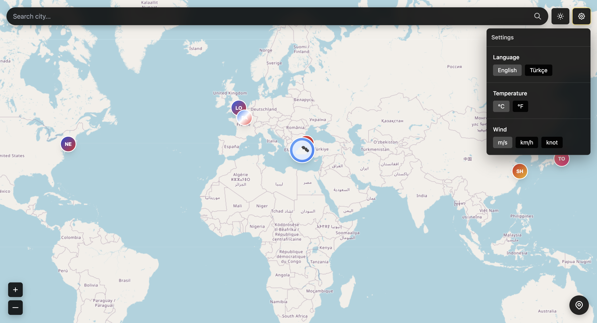
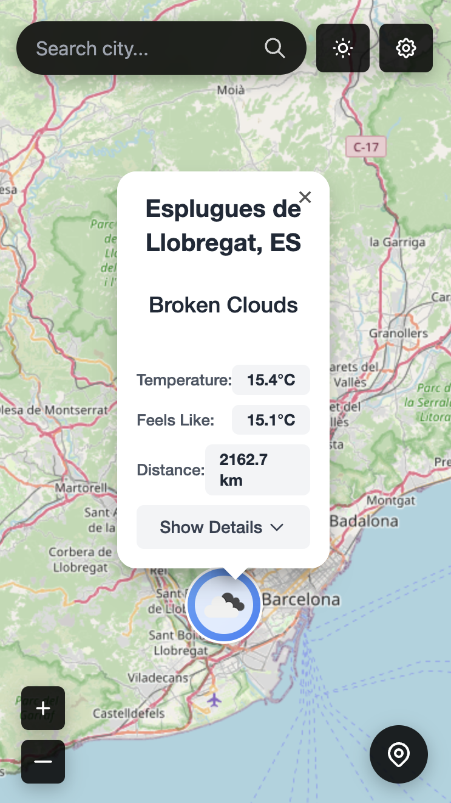

# 🌦️ Weather App

<div align="center">
  
  <h3>A modern, responsive and beautifully designed weather application</h3>
  <p>Built with React, TypeScript, Tailwind CSS and Leaflet</p>
  
  <p>
    
    
    
  </p>
</div>

## ✨ Features

- **🌡️ Current Weather:**
  - Temperature, feels like, min/max, humidity, pressure, wind, visibility, cloudiness, dew point
- **⏰ 24-Hour Forecast:**
  - Hourly temperature, precipitation probability, wind speed, and weather icons
- **☀️ Sun Information:**
  - Sunrise, sunset, day length, local time
- **📈 Weather Trends:**
  - Temperature, wind, and pressure trends with visual indicators
- **☁️ Cloud Status:**
  - Cloud cover percentage and description
- **🗺️ Interactive Map:**
  - Select any location or search for a city
  - See weather for mega cities with custom icons
  - Responsive and mobile-friendly design
- **🎨 Theme Support:**
  - Light and dark mode
- **🌐 Multi-language:**
  - Turkish and English
- **♿ Accessibility:**
  - Keyboard navigation and accessible color contrast

## 📸 Screenshots

<div align="center">
  <table>
    <tr>
      <td align="center">
        <strong>Dark Mode - Main View</strong><br/>
        
      </td>
      <td align="center">
        <strong>Light Mode - Details View</strong><br/>
        
      </td>
    </tr>
    <tr>
      <td align="center">
        <strong>Mobile View</strong><br/>
        
      </td>
      <td align="center">
        <strong>Weather Details Panel</strong><br/>
        
      </td>
    </tr>
  </table>
</div>


## 🚀 Getting Started

### Prerequisites
- Node.js (v16 or higher recommended)
- npm or yarn

### Installation

```bash
# Clone the repository
git clone https://github.com/SabutayBSandalci/sabution-weather.git
cd sabution-weather

# Install dependencies
npm install
# or
yarn install
```

### Running the App

```bash
npm start
# or
yarn start
```

The app will be available at [http://localhost:3000](http://localhost:3000)

### Building for Production

```bash
npm run build
# or
yarn build
```

## 🔑 API Key

This app uses the [OpenWeatherMap API](https://openweathermap.org/api). You need to set your API key in the code:

- Open `src/components/WeatherApp.tsx`
- Replace the value of `API_KEY` with your own key:
  ```js
  const API_KEY = 'YOUR_OPENWEATHERMAP_API_KEY';
  ```

## 📁 Folder Structure

```
src/
  components/
    WeatherApp.tsx      # Main app component with map and weather display
    WeatherDetails.tsx  # Detailed weather information component
    types.ts            # TypeScript type definitions
  ...
```

## 🤝 Contributing

Pull requests are welcome! For major changes, please open an issue first to discuss what you would like to change.

## ✍️ Developer

Developed by Sabutay Batuhan Sandalcı.

- GitHub: [SabutayBSandalci](https://github.com/SabutayBSandalci)
- LinkedIn: [Sabutay Batuhan Sandalci](https://www.linkedin.com/in/sabutay-batuhan-sandalci/)

## 📄 License

This project is licensed under the MIT License. For more information, see the LICENSE file.
